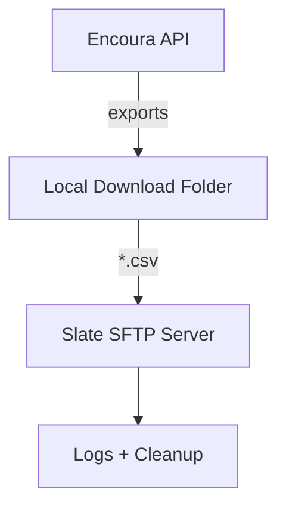

# Encoura API File Downloader & SFTP Uploader

This script automates the process of:  
1. Authenticating with the **Encoura API**  
2. Downloading available exports  
3. Uploading those exports (CSV files) to a Slate SFTP server  

It is designed for admissions operations workflows that need to regularly pull data from Encoura and move it into Slate.  

---

## Table of Contents
- [Features](#features)
- [Requirements](#requirements)
- [Environment Variables](#environment-variables)
- [Configuration](#configuration)
- [Usage](#usage)
- [Logging](#logging)
- [Error Handling](#error-handling)
- [File Flow](#file-flow)
- [Automating with Windows Task Scheduler](#automating-with-windows-task-scheduler)
- [Sources](#sources)
- [License](#license)

---

## Features

- **Encoura API login** with session token management  
- **File retrieval** for all exports with `status=NotDelivered`  
- **Filename sanitization** to ensure OS-safe naming  
- **Automatic download** of files to a local directory  
- **SFTP upload** to Slate (`ft.technolutions.net`) with cleanup of uploaded files  
- **Comprehensive logging** for troubleshooting and auditing  

---

## Requirements

- Python 3.8+  
- Libraries:  
  - `requests`  
  - `paramiko`  
  - `logging` (standard)  
  - `os`, `re`, `pathlib`, `urllib.parse`, `json` (standard)  

Install dependencies with:  

```bash
pip install requests paramiko
```

---

## Environment Variables

This script relies on environment variables for security. Set them in your shell or environment manager:  

| Variable | Description |
|----------|-------------|
| `ENCOURA_API_KEY` | Encoura API key |
| `ENCOURA_ORGANIZATION_UID` | Encoura organization UID |
| `ENCOURA_USERNAME` | Encoura account username |
| `ENCOURA_PASSWORD` | Encoura account password |
| `SLATE_HALIA_SFTP_UN` | Slate SFTP username |
| `SLATE_HALIA_SFTP_PW` | Slate SFTP password |

---

## Configuration

Inside the script, configure:  

- **Log file path**  
  ```python
  FILENAME = r"[path to log file]"
  ```

- **Download folder**  
  ```python
  DOWNLOAD_DIR = r"[path to download folder]"
  ```

---

## Usage

Run the script directly:  

```bash
python encoura_downloader.py
```

It will:  
1. Open a session with the Encoura API  
2. Log in and fetch available exports  
3. Save the files locally into your configured download directory  
4. Upload `.csv` files to Slate via SFTP (`/incoming/Encoura API Uploads/`)  
5. Delete the local CSVs after successful upload  

---

## Logging

The script writes logs to the configured file (`FILENAME`) with the format:  

```
2025-09-24 08:00:00,123 - download_files - INFO - Downloading file from url ...
```

Logs include:  
- Successful login  
- Files retrieved and saved  
- Upload success/failure messages  
- Error details for troubleshooting  

---

## Error Handling

- **Authentication failures** (Encoura API or SFTP) are logged  
- **Permissions errors** on the SFTP server are logged per file  
- **Other exceptions** (timeouts, connection issues) are caught and recorded  

---

## File Flow



---

## Automating with Windows Task Scheduler

You can configure Windows Task Scheduler to run this script daily without manual intervention.

### Step 1. Open Task Scheduler
1. Press **Win + R**, type `taskschd.msc`, and press **Enter**.  
2. In the right-hand pane, click **Create Task…**.

---

### Step 2. General Settings
- **Name**: e.g., `Encoura File Downloader`  
- **Description**: Runs the Encoura API downloader and uploads files to Slate.  
- Check **Run whether user is logged on or not**.  
- Check **Run with highest privileges**.  

---

### Step 3. Triggers (When to Run)
1. Go to the **Triggers** tab → click **New…**  
2. Choose **Daily** (or adjust as needed).  
3. Set the **Start time** (e.g., 6:00 AM).  
4. Click **OK**.

---

### Step 4. Actions (What to Run)
1. Go to the **Actions** tab → click **New…**  
2. **Action**: Start a program.  
3. **Program/script**: `python`  
4. **Add arguments**:  
   ```bash
   "C:\Path\To\encoura_downloader.py"
   ```
   *(include quotes if your path has spaces)*  
5. **Start in (optional)**: The folder where your script is located.  
6. Click **OK**.

---

### Step 5. Conditions & Settings
- In **Conditions**: Uncheck *Start the task only if the computer is on AC power* if you want it to run on battery.  
- In **Settings**: Check *Run task as soon as possible after a scheduled start is missed*.  

---

### Step 6. Save & Test
- Click **OK** to save the task.  
- Enter your Windows credentials if prompted.  
- To test: Right-click the task → **Run**.  

---

## Sources

This project was developed with reference to:  

- [Encoura API Documentation (PDF)](https://helpcenter-content.encoura.org/static-assets/content/documents/encoura-api-documentation.pdf)  
- [NRCCUA File Export Sample on GitHub](https://github.com/nrccua/file_export_sample)  

---

## License

This project is provided under the MIT License. See [LICENSE](LICENSE) for details.
